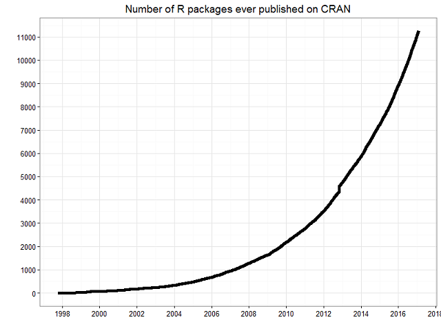
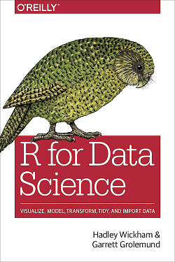

A short introduction to R
========================================================
author: Niels Aka
date: 1st December 2017
autosize: true
incremental: false

Why R?
========================================================

Taken from [here](https://www.r-bloggers.com/cran-now-has-10000-r-packages-heres-how-to-find-the-ones-you-need/).

Why R?
========================================================

* great for statistics and visualisations

* programming language
  + comprehensive set of tools (apart from statistics)
  
  + interactive
  
  + multi-paradigm
  
  + reproducibility

Why R? Community
========================================================
  + learning resources
  
  + development of new tools
  
  + feedback
  
  + conferences, meetings
  
  + ... and spirit

Why R? Extensions
========================================================

  + this presentation was made in RStudio!
  
  + $\alpha + \beta = \frac{\pi}{2}$ = 1.5707963
  
  + reproducible reports
  
  + interactive web pages for data exploration
  
  + outsource heavy computations to c++

Why not R?
========================================================

* can be slow and buggy
  + "weakly typed"
  + if not working with arrays
  
* sometimes messy
  + few conventions
  + few standardised interfaces
  + rarely *one* obvious solution
  + overlapping solutions; too many options, packages
  

Tidyverse
========================================================

+ https://www.tidyverse.org/

+ tidy data
  * one variable = one column
  * one observation = one row

+ standardised interfaces and naming conventions

Learning resources
========================================================

http://r4ds.had.co.nz/

***

 

https://www.datacamp.com/

Other useful resources
========================================================

* https://www.r-bloggers.com/

* https://stackoverflow.com/questions/tagged/r

* https://www.rstudio.com/

* https://www.google.de/
